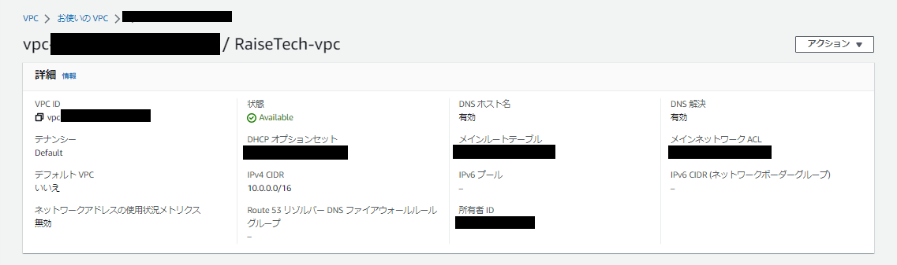
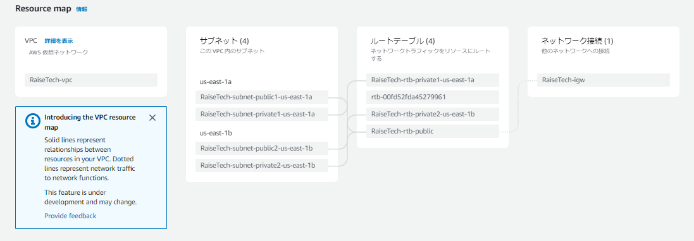
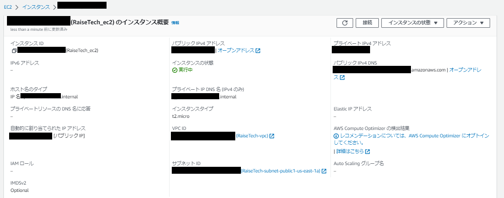
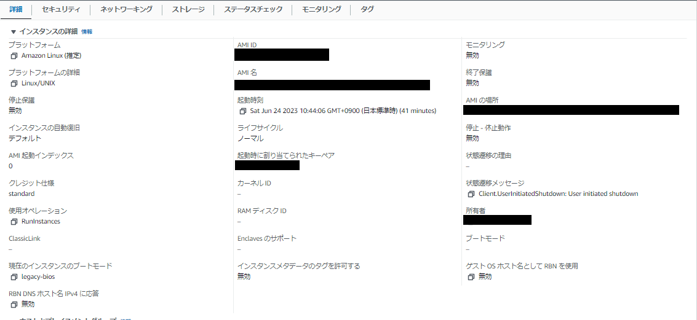
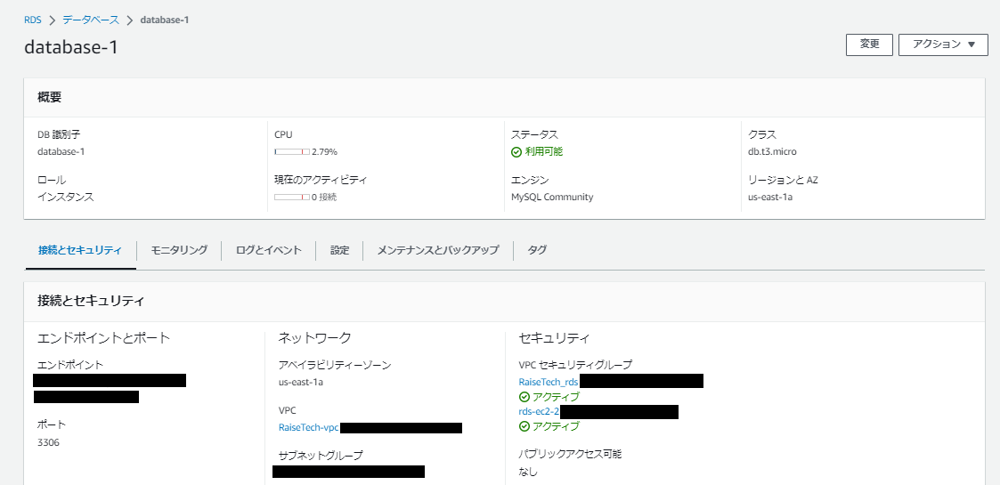
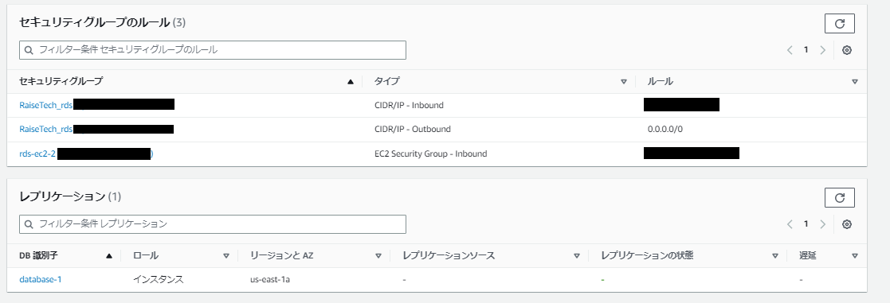

# 第４回課題

### VPC・サブネット構築

### EC2 インスタンス作成
※ OS：Amazon Linux2　使用のこと

### RDS データベース作成
※ストレージの自動スケーリングは外すこと

### EC2からRDSへ接続

##### MySQLインストール
 sudo yum install mysql
##### インストール後、接続
mysql -u admin -p -h データベースのエンドポイント

参考：[初心者向けEC2からRDSへ接続してみた](https://blog.serverworks.co.jp/ec2-to-private-rds)

## 今回学んだこと
AWS内では各構築が選択するだけ本当に簡単にできてしまうので、  
慎重に選択しなければならないと思いました。  
（構想図を参考にすることでイメージしやすいかもと思ったので、今後活用していきたい）

はじめ、OSをAmazon Linux2023で作成してしまい、再作成することになりました。  
他の受講生の指摘されるまで自身は全く気付いていませんでした…  
何事も取り組む前の事前確認や情報収集が大切であると身をもって感じました。  
”よく見て、よく聞いて、よく考える”
